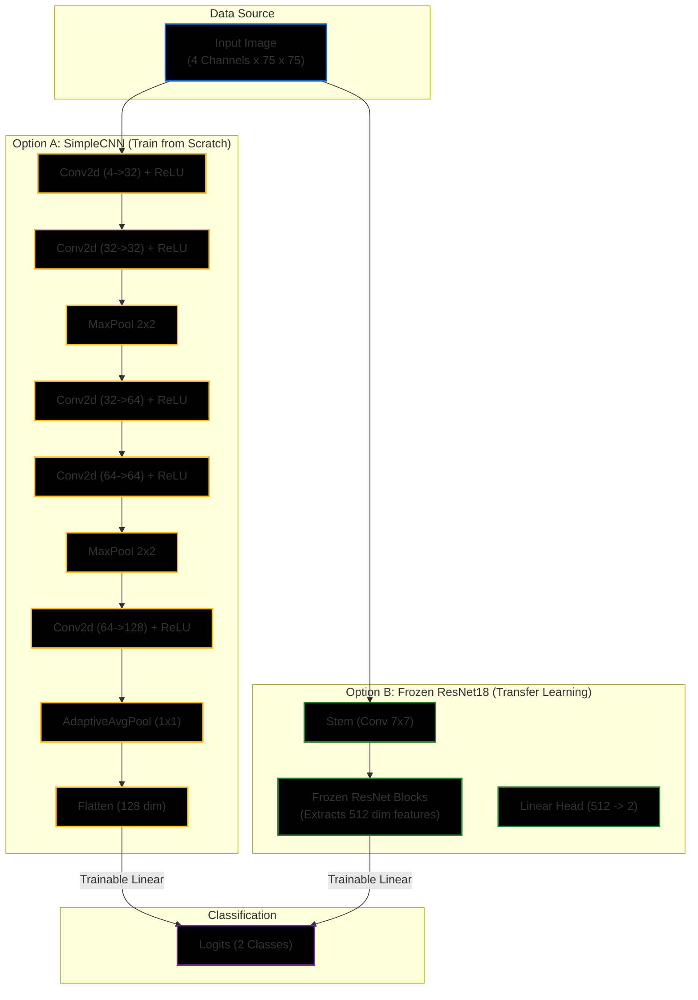

```mermaid
graph TD
    %% Styling
    classDef input fill:#000000,stroke:#1565c0,stroke-width:2px;
    classDef cnn fill:#000000,stroke:#fbc02d,stroke-width:2px;
    classDef resnet fill:#000000,stroke:#2e7d32,stroke-width:2px;
    classDef head fill:#000000,stroke:#7b1fa2,stroke-width:2px;

    subgraph Data ["Data Source"]
        Img["Input Image<br/>(4 Channels x 75 x 75)"]:::input
    end

    subgraph SimpleCNN ["Option A: SimpleCNN (Train from Scratch)"]
        direction TB
        S_C1["Conv2d (4->32) + ReLU"]:::cnn
        S_C2["Conv2d (32->32) + ReLU"]:::cnn
        S_Pool1["MaxPool 2x2"]:::cnn
        S_C3["Conv2d (32->64) + ReLU"]:::cnn
        S_C4["Conv2d (64->64) + ReLU"]:::cnn
        S_Pool2["MaxPool 2x2"]:::cnn
        S_C5["Conv2d (64->128) + ReLU"]:::cnn
        S_Pool3["AdaptiveAvgPool (1x1)"]:::cnn
        S_Flat["Flatten (128 dim)"]:::cnn
    end

    subgraph ResNet ["Option B: Frozen ResNet18 (Transfer Learning)"]
        direction TB
        R_Stem["Stem (Conv 7x7)"]:::resnet
        R_Body["Frozen ResNet Blocks<br/>(Extracts 512 dim features)"]:::resnet
        R_Head["Linear Head (512 -> 2)"]:::resnet
    end

    subgraph Output ["Classification"]
        Logits["Logits (2 Classes)"]:::head
    end

    %% Connections
    Img --> S_C1
    S_C1 --> S_C2 --> S_Pool1 --> S_C3 --> S_C4 --> S_Pool2 --> S_C5 --> S_Pool3 --> S_Flat
    
    Img --> R_Stem
    R_Stem --> R_Body
    
    S_Flat -->|Trainable Linear| Logits
    R_Body -->|Trainable Linear| Logits
```