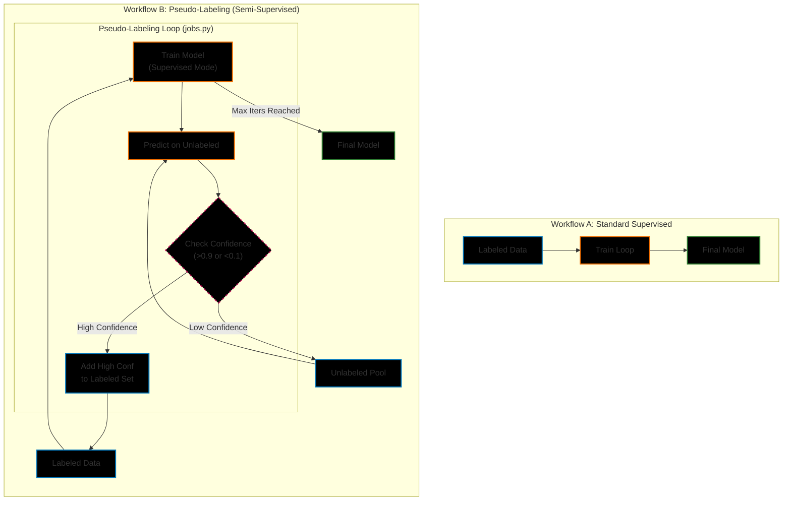

```mermaid
flowchart TD
    %% Styling
    classDef data fill:#000000,stroke:#0277bd,stroke-width:2px;
    classDef process fill:#000000,stroke:#ef6c00,stroke-width:2px;
    classDef model fill:#000000,stroke:#2e7d32,stroke-width:2px;
    classDef loop fill:#000000,stroke:#c2185b,stroke-width:2px,stroke-dasharray: 5 5;

    subgraph Standard ["Workflow A: Standard Supervised"]
        L_Data["Labeled Data"]:::data
        Train1["Train Loop"]:::process
        Model1["Final Model"]:::model
        
        L_Data --> Train1 --> Model1
    end

    subgraph Pseudo ["Workflow B: Pseudo-Labeling (Semi-Supervised)"]
        direction TB
        P_Labeled["Labeled Data"]:::data
        P_Unlabeled["Unlabeled Pool"]:::data
        
        subgraph PL_Loop ["Pseudo-Labeling Loop (jobs.py)"]
            Train2["Train Model<br/>(Supervised Mode)"]:::process
            Predict["Predict on Unlabeled"]:::process
            Filter{"Check Confidence<br/>(>0.9 or <0.1)"}:::loop
            
            NewLabels["Add High Conf<br/>to Labeled Set"]:::data
        end
        
        Model2["Final Model"]:::model
        
        P_Labeled --> Train2
        P_Unlabeled --> Predict
        Train2 --> Predict
        Predict --> Filter
        Filter -->|High Confidence| NewLabels
        NewLabels --> P_Labeled
        Filter -->|Low Confidence| P_Unlabeled
        
        Train2 -->|Max Iters Reached| Model2
    end
```