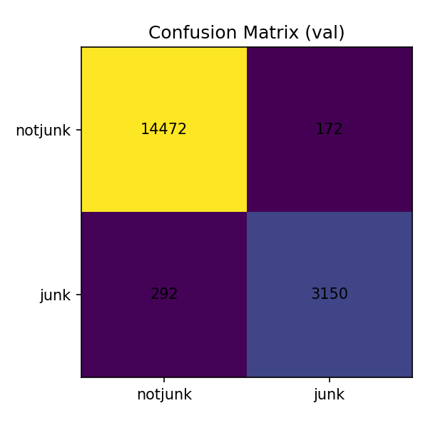
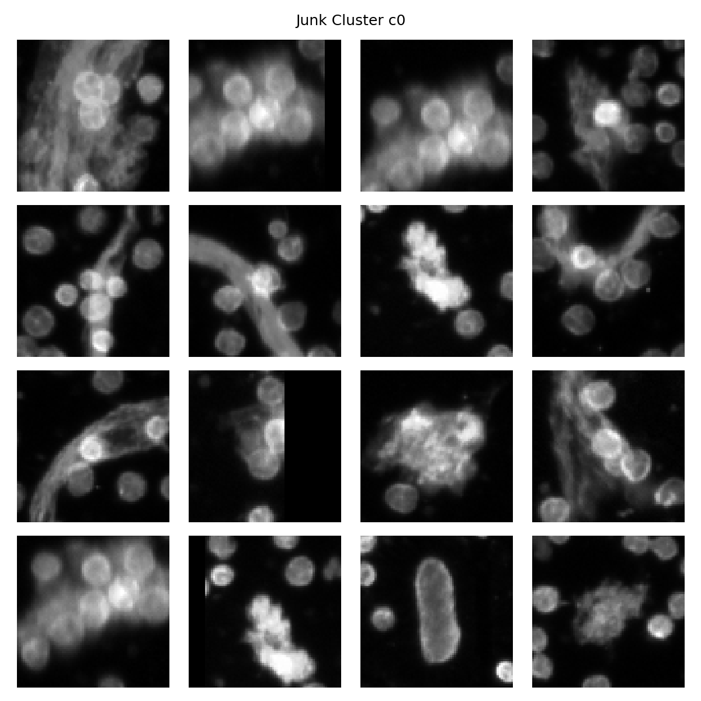
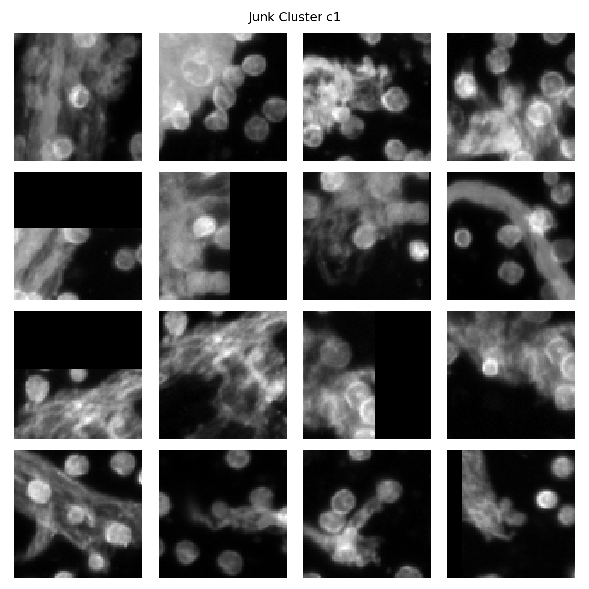
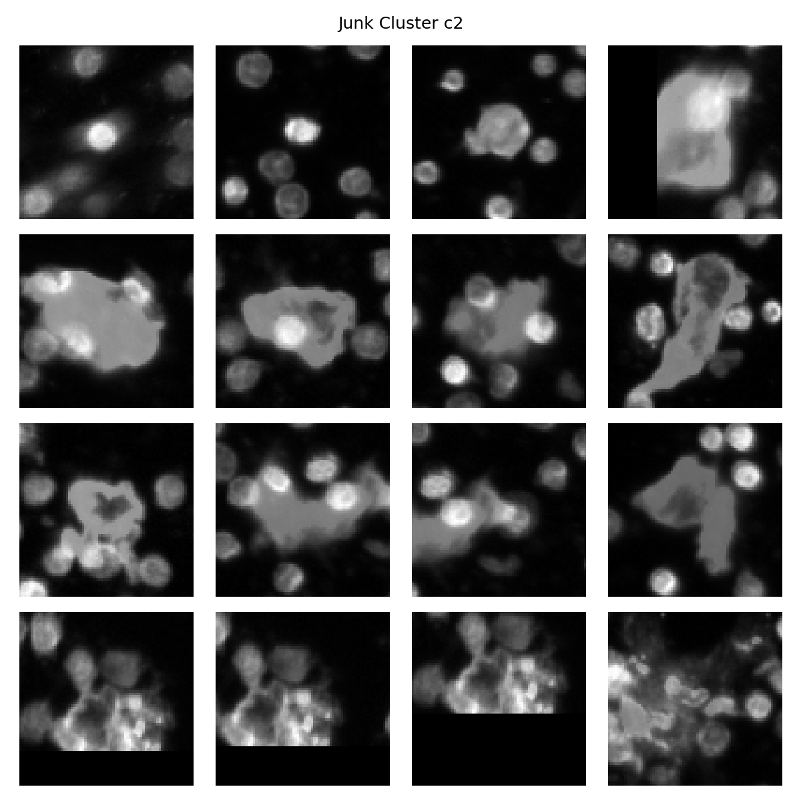
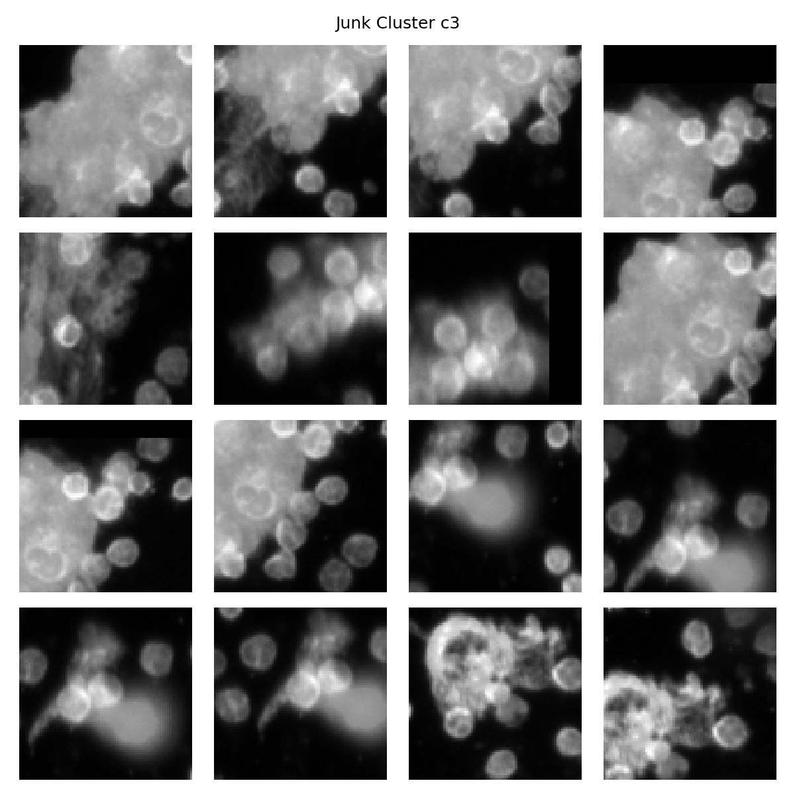
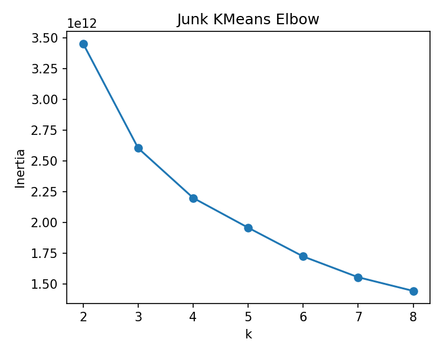
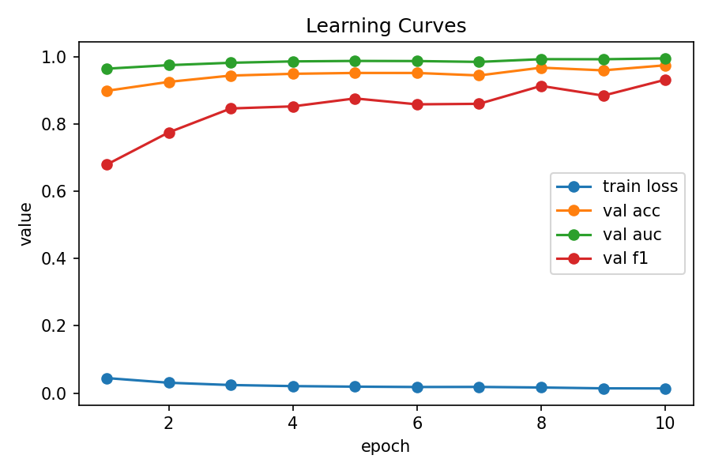
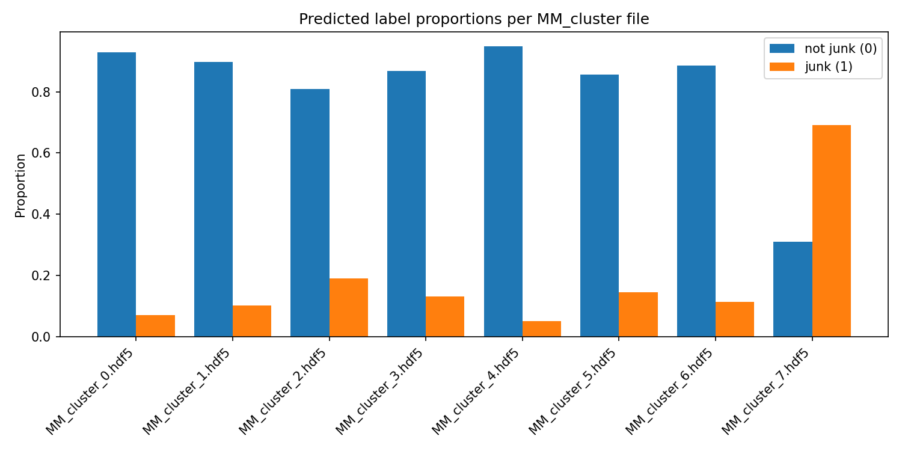

# Junk-vs-Rest CNN Experiment
**Run Time:** 2025-10-24T15:10:37.757276

## 1. Parameters
- Root: `/mnt/deepstore/Vidur/Junk Classification/data_model_labels`
- Epochs: 10
- Batch Size: 256
- LR: 0.001
- Focal (alpha, gamma): (0.25, 2.0)
- Non-Junk : Junk Ratio = 1.5
- Junk K-Means Max K = 8
- Target HW = 75
- Seed = 42

## 2. Hardware & Environment
- Python: 3.11.13
- Torch: 2.8.0+cu126
- GPU: NVIDIA GeForce RTX 4090
NVIDIA GeForce RTX 4090

## 3. Validation Metrics (Best)
- Accuracy: 0.974
- AUC:      0.995
- F1:       0.931

## 4. Grad-CAM Center vs Border (Val sample)
- Mean Center/Border Ratio: 24812.212890625
- Median Center/Border Ratio: 10100.689453125
- Per-Class NotJunk: 20531.982421875
- Per-Class Junk:    42337.73046875
- Samples: 1024
- DAPI channel index used: 0

## 5. Key Plots

## 6. Grad-CAM PDFs
- [gradcam_val_composite.pdf](gradcam_val_composite.pdf)
- [gradcam_val_dapi_only.pdf](gradcam_val_dapi_only.pdf)

## 7. Notes
- [ ] Elbow K = ?
- [ ] Validation trends stable by epoch ~?
- [ ] Center/Border focus sufficiently > 1.5?
- [ ] Clusters 3–4 non-junk enriched?

---
*(Generated automatically by this notebook)*